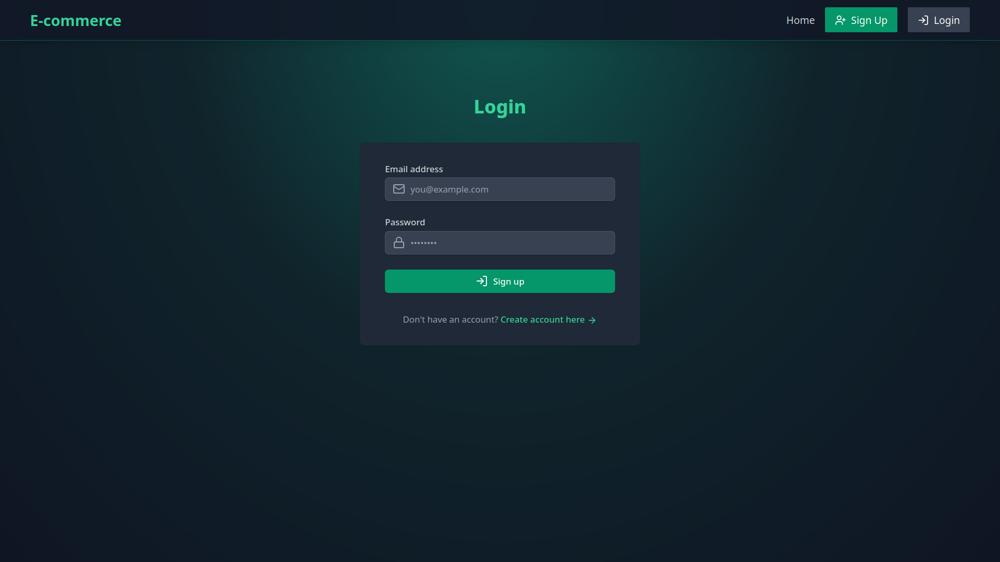
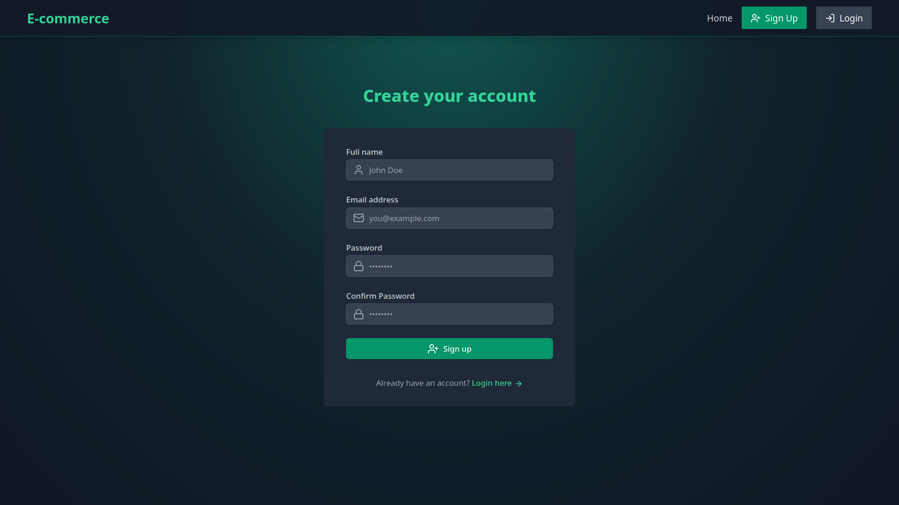
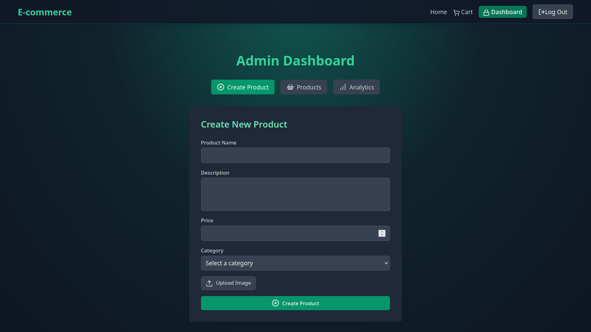
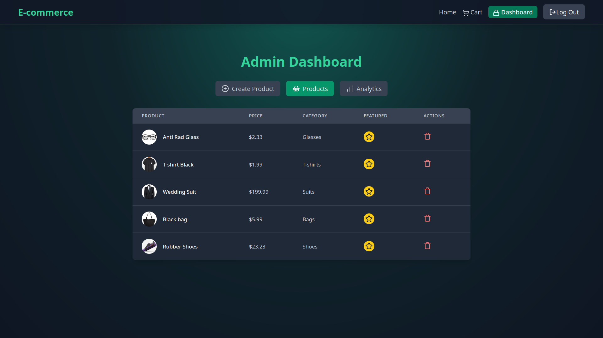
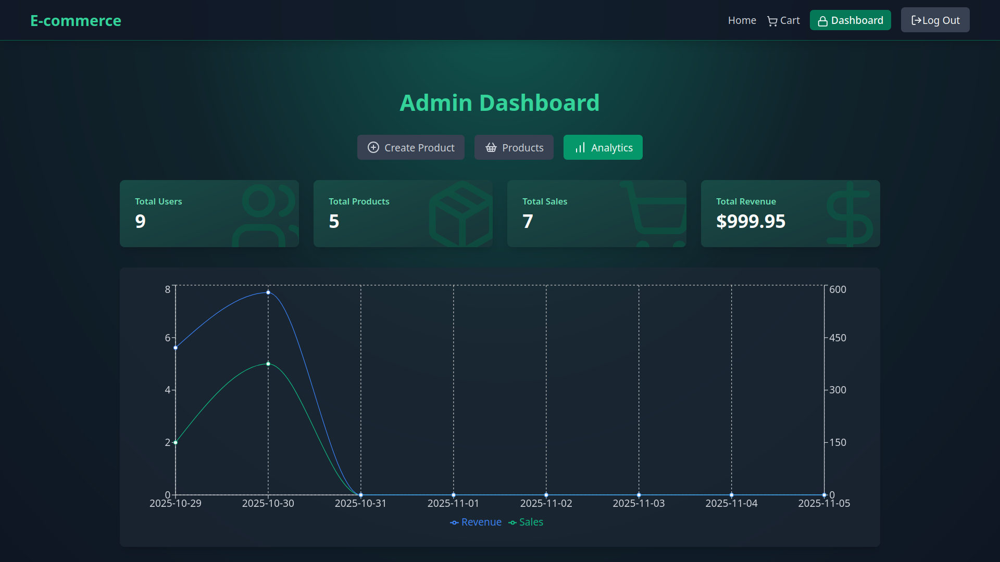
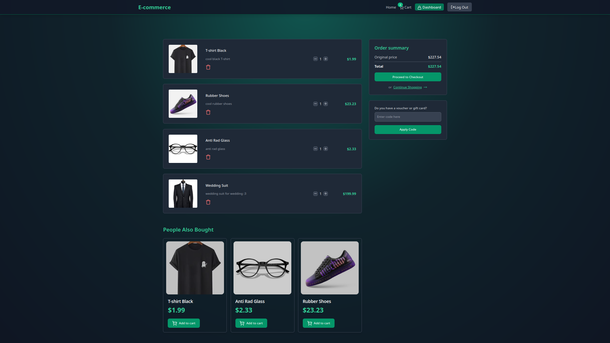
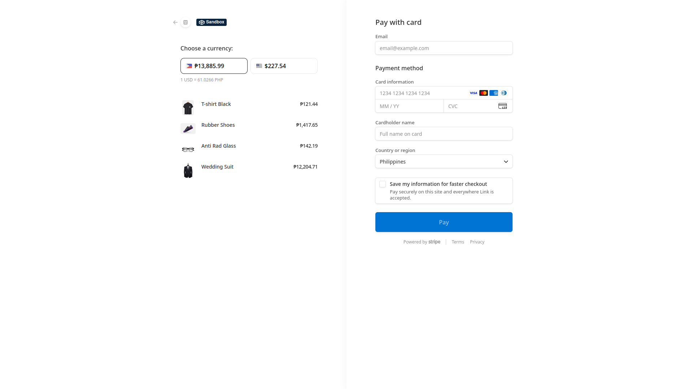
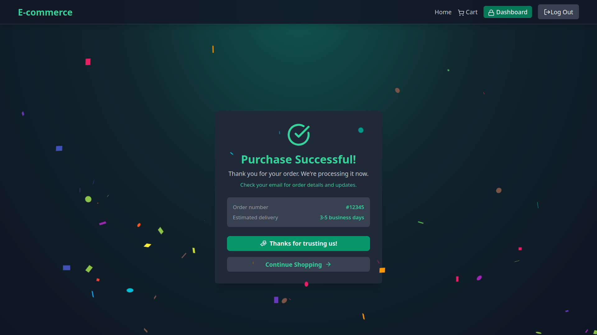
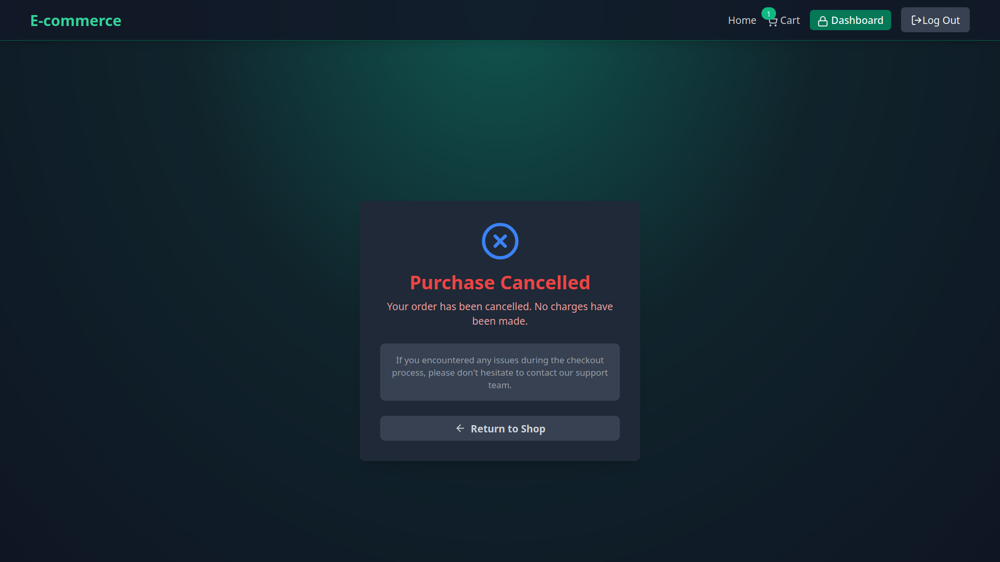

# 🛒 E-Commerce Store

A **full-featured e-commerce store** built with the **MERN stack** — offering **user authentication**, **admin dashboard**, **CRUD operations**, **analytics**, and **secure payments with Stripe**.  
Customers receive **coupon discounts** after spending $200+!


## 🔐User Authentication
<p align="center">
  
  
</p>

## 👑Admin Dashboard

### Create Products


### Product List


### Analytics


## Checkout Page


## Stripe


## Payment Successfull


## Payment Cancel



## 🌍 Live Demo
🟢 **[Try it here →](https://e-commerce-app-ap3d.onrender.com/)**  


## 💡 Motivation
I built this project to strengthen my **full-stack development** skills, improve my **problem-solving ability**, and gain experience designing scalable web applications from scratch.


## 🚀 Features
- 🗄️ **MongoDB & Redis** integration  
- 💳 **Stripe Payment** integration  
- 🔐 **JWT Authentication** (Access + Refresh Tokens)  
- 🛍️ **E-Commerce Core** (Cart, Checkout, Coupons)  
- 👑 **Admin Dashboard** with Product Management  
- 📊 **Sales Analytics**  
- 🎨 **Responsive UI** built with TailwindCSS  
- 🛡️ **Security & Data Protection**
- 🚀 **Caching with Redis**

## 🛠️ Tech Stack
| Layer | Technology |
|-------|-------------|
| Frontend | React, Vite, Tailwind CSS |
| Backend | Node.js, Express.js |
| Database | MongoDB (Mongoose) |
| Real-time | Socket.io |
| Email Service | Resend API |
| Auth | JSON Web Tokens (JWT) |

🔑 Environment Variables
PORT=8080
MONGO_URI=your_mongodb_uri

UPSTASH_REDIS_REST_URL=your_redis_url
UPSTASH_REDIS_REST_TOKEN=your_redis_token

ACCESS_TOKEN_SECRET=your_access_token
REFRESH_TOKEN_SECRET=your_refresh_token

CLOUDINARY_CLOUD_NAME=your_cloudinary_name
CLOUDINARY_API_KEY=your_cloudinary_api
CLOUDINARY_API_SECRET=your_cloudinary_secret

STRIPE_SECRET_KEY=your_stripe_secret_key

CLIENT_URL=http://localhost:5173

NODE_ENV=development


## ⚙️ Installation

### 1️⃣ Clone the repository
```bash
git clone https://github.com/ronronrivera/e-commerce-app
cd e-commerce-app

2️⃣ Install dependencies

cd backend
npm install

cd frontend
npm install


🧩 Running the App
cd backend
npm run dev

cd frontend
npm run dev
